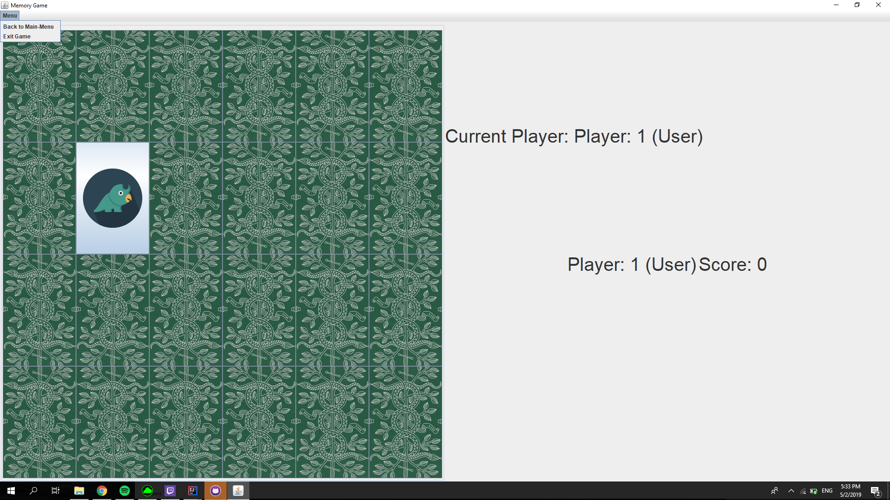

# MEMORY GAME # 

A Memory Game played with cards impleneted using Java.

## The game includes the following:

### Game-Modes:
- Basic: Includes 2 copies of 12 different cards, which will be randomly placed on a grid of 4 rows and 6 columns. The player chooses successively and sees 2 cards. If they are the same, they pick them up, otherwise the cards are hidden.
- Double: Includes 2 copies of 24 different cards, which will be randomly placed on a grid of 6 rows and 8 columns. The player chooses successively and sees 2 cards. If they are the same, they pick them up, otherwise the cards are hidden
- Triple: Includes 3 copies of 12 different cards, which will be placed randomly on a grid of 6 rows and 6 columns. The player chooses successively and sees 3 cards. If they are the same, they pick them up, otherwise the cards are hidden.
- Duel: In this variation, two players are strictly playing, one of which could be computer-controlled as in the other variants, in two different grids of 6 rows and 4 columns. There are 24 images, copies of which are divided into 2 discrete meshes. Each player can open cards only from their own grid. A player starts by opening his own card, and the other player answers by opening his own card. If they are the same, the second player wins. Then the player who plays first changes.
  
  *All modes can be played with or without Computer Bots with various difficulties *
  
 ### Basic Graphical interface with menus and images for the users to interact and play:
 

### Other features:
- Able to save high-scores
- Languages supported: English US, English UK, Greek
- Tests for each Class (Using jUnit 4)

